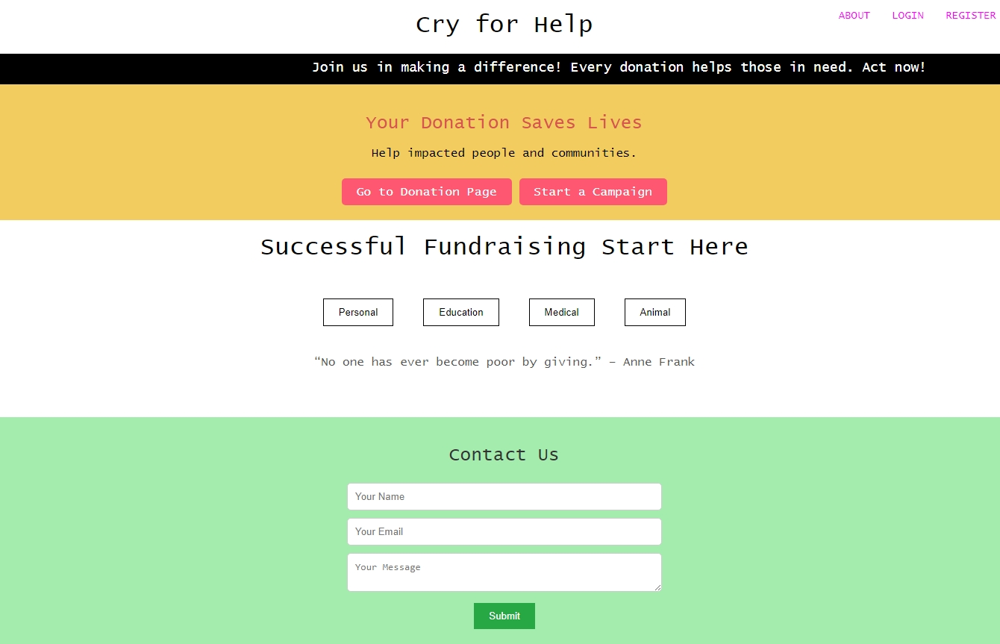

# Cry for Help Crowdfunding Website

## Project Vision

The **"Cry for Help" Crowdfunding Website** is designed to be an accessible and impactful platform that helps individuals, communities, and organizations raise funds for various causes. The main goal of the project is to connect donors with those in need by providing a simple, intuitive interface that encourages charitable giving and support for causes such as education, medical emergencies, animal welfare, and personal initiatives.

## Key Features of the Project

1. **Urgent Call to Action:**
   - The homepage includes a **running text** that highlights urgent messages, creating a sense of urgency to inspire immediate donations.
   - Motivational quotes and attention-grabbing elements make it clear to users why their contributions are needed.

2. **Donation Categories:**
   - The platform is organized into various **donation categories**, such as **Your Cause**, **Education**, **Medical**, and **Animal Welfare**, making it easier for users to find causes they care about and contribute to.

3. **Responsive Design:**
   - The website’s **responsive design** ensures that users have a seamless experience whether they are browsing on a desktop, tablet, or mobile device.

4. **User Interaction & Navigation:**
   - Easy-to-use **navigation** and **call-to-action buttons** such as **"Donate to Needy"** and **"Find Fundraisers"** make it simple for users to quickly engage with the platform and begin their donation journey.

5. **User Login & Contact Pages:**
   - Users have the ability to log in to their profiles, manage their donations, and keep track of their contributions.
   - A **Contact Us** form is available for users to reach out for assistance or to inquire about the platform’s services.

## Technologies Used

- **Frontend:** The project uses **HTML** and **CSS** to structure and style the website. It includes a scrolling **marquee effect** on the homepage to grab users' attention. The website’s layout is designed to be responsive, ensuring compatibility across devices.
- **Backend:** Built using **XAMPP**, which serves as the local server environment during development, making it easy to test and deploy the website.
- **Styling & Responsiveness:** The **CSS** styles ensure a modern, clean, and accessible design, adapting seamlessly to various screen sizes for users on all devices.

## Target Audience

The **Cry for Help** website is designed to serve:
- **Donors**: People who wish to contribute to charitable causes and make a difference in the lives of others.
- **Fundraisers**: Individuals or organizations who need financial support for their causes, such as medical treatment, education, or humanitarian projects.
- **Communities**: The broader public who are looking for easy and effective ways to support and raise awareness for different social, educational, and medical initiatives.

## User Experience and Accessibility

The overall goal of the **Cry for Help** platform is to create an **easy, welcoming**, and **intuitive** environment for users. The design and functionality emphasize accessibility, ensuring that users, regardless of their technical expertise, can quickly navigate through the platform and make their contributions.

- The **clear layout** and **well-defined categories** allow users to select causes they are passionate about.
- The **motivational quotes** and **calls to action** provide emotional encouragement to help drive donations.
- The **responsive design** ensures that the platform can be accessed seamlessly across different devices.

## Project Potential and Future Scope

While the **Cry for Help** crowdfunding website is already a fully functional platform, there is significant potential for growth and improvement. Some possible future enhancements include:

1. **Payment Gateway Integration:** To enable direct online donations through secure and popular payment platforms.
2. **Real-time Fundraiser Updates:** Users could track how much has been raised for each cause in real-time.
3. **User Authentication and Profiles:** Implementing user login and profile management would allow users to track their donations, fundraisers, and create personal accounts.
4. **Social Media Integration:** Allowing users to share fundraising campaigns on social media to increase awareness and contributions.
5. **Admin Dashboard:** An admin panel to manage fundraisers, monitor progress, and ensure that donations are being used properly.

## Conclusion

The **Cry for Help** crowdfunding website is an impactful and easy-to-use platform designed to connect those in need with donors who are willing to support important causes. Its key features, such as donation categories, calls to action, and responsive design, ensure an engaging user experience. By continuously evolving with future features like payment integration and user authentication, the platform can become a valuable tool for charity work and social good.

---

## Getting Started

To get a local copy up and running, follow these simple steps.

### Prerequisites

- PHP
- MySQL
- XAMPP or any similar local server environment

### Installation

1. Clone this repository:
   ```bash
   git clone https://github.com/your-username/cry-for-help.git
# Cry for Help Crowdfunding Website Pic


   

### How to Use This
1. Copy the text and paste it into the `README.md` file in the root of your project.
2. If needed, replace the placeholder `https://github.com/your-username/cry-for-help.git` with your actual GitHub repository URL.
3. You can adjust the **Getting Started** section if you have different setup instructions or requirements.

This **README** provides an overview of the project, its features, technologies used, and instructions for getting started locally. You can customize the text as per your project's specific details.
